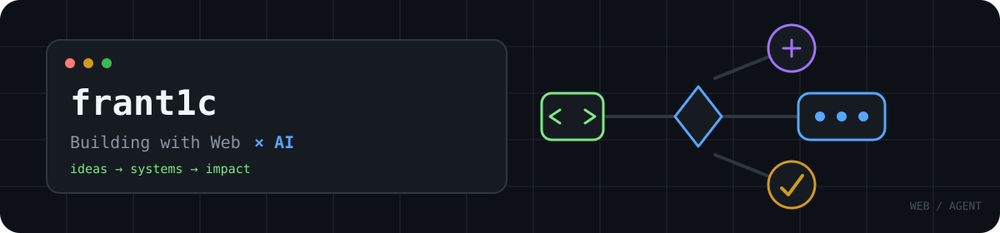

  <picture>
    <source media="(prefers-color-scheme: dark)" srcset="https://readme-typing-svg.demolab.com?font=JetBrains+Mono&amp;weight=500&amp;size=19&amp;duration=3200&amp;pause=1200&amp;color=58A6FF&amp;center=true&amp;vCenter=true&amp;width=680&amp;lines=Building+at+the+intersection+of+Web+%26+AI;Exploring+reliable+AI+Agents;Turning+ideas+into+working+software">
    
  </picture>

## About me

一名拥抱 AI 的开发者，计算机科学与技术本科在读。

关注 **AI Agent 工程、Vue / TypeScript、前端性能与工程效率**。喜欢把复杂问题拆成可验证、可维护的解决方案，并持续探索 AI 与软件开发的结合方式。

## Selected projects

### [EvidentLoop](https://github.com/Frant1cc/evident-loop)

证据驱动的可恢复研究 Agent，面向长周期研究任务，支持任务恢复、联网检索、Hybrid RAG 与 MCP 工具扩展。

`Node.js` `Express` `Vue 3` `SQLite` `Qdrant` `MCP`

### [The Micro Step Generator](https://github.com/Frant1cc/The-Micro-Step-Generator)

基于 BJ Fogg 行为模型的动态目标拆解助手，将抽象目标转换为更容易执行的微步骤。

`Vue` `AI Application` `Hackathon`

### [Video Scroll Demo](https://github.com/Frant1cc/video-scroll-demo)

探索滚动输入与视频播放进度联动的交互 Demo。

`TypeScript` `Web Interaction`

## Tech

<picture>
  <source media="(prefers-color-scheme: dark)" srcset="https://skillicons.dev/icons?i=js%2Cts%2Cvue%2Cnodejs%2Cexpress&amp;theme=dark">
  
</picture>

## Highlights

- **TRAE SOLO Hackathon 广州场 · 城市最佳项目奖**

---

> Build things, measure the result, and keep improving.
